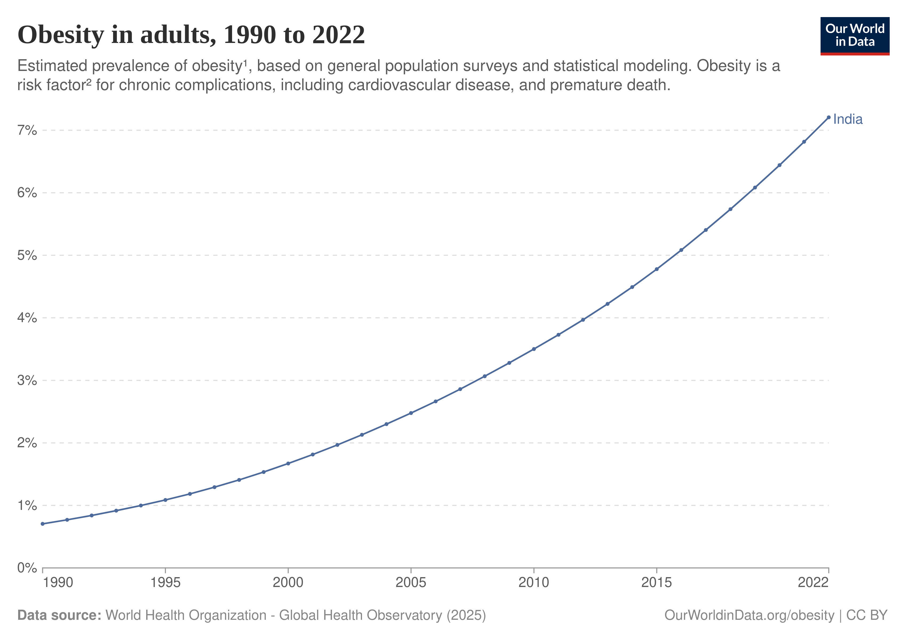

# Project Report

- [Project Report](#project-report)
	- [Anti-Obesity Medication Market Sizing](#anti-obesity-medication-market-sizing)
		- [Obesity Prevalence](#obesity-prevalence)
		- [Semaglutide Market Size Forecasting](#semaglutide-market-size-forecasting)
	- [Diabetes Subphenotype-Based Market Identification](#diabetes-subphenotype-based-market-identification)
		- [Introduction](#introduction)
		- [Data Assets](#data-assets)
		- [Feature Normalisation Strategy](#feature-normalisation-strategy)
		- [Derived Proxy Indices](#derived-proxy-indices)
		- [Subphenotype Attribution Workflow](#subphenotype-attribution-workflow)
		- [Prior Calibration and Regularisation](#prior-calibration-and-regularisation)
		- [Prioritisation Metrics for GLP-1 Planning](#prioritisation-metrics-for-glp-1-planning)
	- [Cost-Benefit Analysis Simulation](#cost-benefit-analysis-simulation)
		- [Parameterisation and Cohort Construction](#parameterisation-and-cohort-construction)
		- [Condition Incidence and Progression Graph](#condition-incidence-and-progression-graph)
		- [Modelling the GLP-1 Intervention](#modelling-the-glp-1-intervention)
		- [Individual State Machine and Event Memory](#individual-state-machine-and-event-memory)
		- [Cost Model and Cash-Flow Tracking](#cost-model-and-cash-flow-tracking)
		- [Output Diagnostics and Scenario Analysis](#output-diagnostics-and-scenario-analysis)
	- [Visualisation Module: Data Flow](#visualisation-module-data-flow)
		- [Data Assets](#data-assets-1)
		- [GeoJSON Augmentation and Layer Styling](#geojson-augmentation-and-layer-styling)

## Anti-Obesity Medication Market Sizing

### Obesity Prevalence

We used the NFHS-5 survey data to estimate the obesity prevalence within urban and rural populations in India and also to see differences in obesity prevalence across the two sexes.

We also used obesity prevalence data from [source](https://ourworldindata.org/grapher/share-of-adults-defined-as-obese?tab=line&country=~IND&mapSelect=~IND) to see the trend in obesity rates from 1990 till 2022.

We also discovered the following relation between obesity prevalence rates across different age groups and gender through this [lancet paper](https://www.thelancet.com/journals/lansea/article/PIIS2772-3682(23)00068-9/fulltext#:~:text=Economic%20survey%20of%20India%202022%2D23%20The%20prevalence,be%20more%20obese%20than%20the%20younger%20ones.)

### Semaglutide Market Size Forecasting

We saw the relation between [semaglutide market size in Germany](https://www.grandviewresearch.com/horizon/outlook/semaglutide-market/germany) and the obesity prevalence rates in Germany(https://ourworldindata.org/grapher/share-of-adults-defined-as-obese?tab=chart&country=DEU). We assumed that the Indian semaglutide market will follow the same relation between obesity prevalence rates and market size as Germany, this was to estimate the market size of semaglutide in India. The following is the result of our market sizing algorithm

## Diabetes Subphenotype-Based Market Identification

### Introduction

This module estimates heterogeneity within the Indian type 2 diabetes population and communicates actionable insights for treatment prioritisation. Two coupled modules implement this objective. The `subphenotype/` pipeline transforms National Family Health Survey (NFHS-5) indicators into calibrated prevalence estimates for the five canonical indian diabetes clusters described in endocrinology literature. The `visualization/` workflow augments those outputs with adoption proxies and renders an interactive folium map that guides health planners toward districts most likely to benefit from glucagon-like peptide-1 (GLP-1) therapies.

### Data Assets

The processing pipeline consumes curated public health indicators assembled in `subphenotype/data/clean.csv` (derived from offical NFHS-5 data) The clean NFHS-5 matrix combines anthropometric, metabolic, and demographic measures across more than 700 districts.

### Feature Normalisation Strategy

Following schema checks, the notebook computes standardised indicators. Each series is mean-imputed and translated into a population-level z-score. The helper explicitly handles degenerate distributions by returning zero vectors when the standard deviation is zero or undefined — a contingency that can surface in sparsely populated districts where certain screenings were not performed. This choice neutralises outlier districts without introducing `NaN` cascades, allowing downstream matrix operations to remain stable. Standardisation is performed at the national level, respecting the comparative framing used in the clustering literature. Indicators measured separately for men and women (`OVER`, `UNDER`, `WAIST`, `HTN`, `GLU`) are averaged with equal weights after standardisation to construct sex-balanced signals.

### Derived Proxy Indices

The project distils ten observable indicators into four interpretable latent indices: insulin resistance (IR), insulin deficiency (DEF), glycaemic burden (GLY), and age-related risk (AGE). Each index is defined as a weighted sum of the z-scored features, with coefficients chosen to reflect consensus findings from cluster analyses in European, US, and Indo-Asian cohorts. For example, the insulin resistance score emphasises waist circumference (0.45) and overweight prevalence (0.35), capturing central adiposity, while adding a smaller hypertension component (0.20) to encode vascular consequences of systemic resistance. The deficiency index is dominated by underweight prevalence (0.50) but subtracts overweight and waist components to isolate lean phenotypes. Glycaemic burden is mapped directly to the pooled high-glucose prevalence since hyperglycaemia is already a composite indicator. The age-related index mirrors the aged population share, acknowledging the MARD (Mild Age-Related Diabetes) cluster’s defining trait.

### Subphenotype Attribution Workflow

Subtype attribution proceeds in two stages: raw logit estimation followed by probabilistic calibration. The raw logits are linear blends of the four proxies, with coefficients informed by clinical archetypes. A simplified summary is presented below:

| Subphenotype | Logit Formula Rationale |
| --- | --- |
| SIDD (Severe Insulin-Deficient Diabetes) | `0.50 × GLY + 0.30 × DEF − 0.20 × AGE` prioritises pronounced hyperglycaemia and deficiency while down-weighting older age to capture early-onset lean diabetes. |
| SIRD (Severe Insulin-Resistant Diabetes) | `0.60 × IR + 0.40 × GLY` reflects heavy reliance on central adiposity and metabolic syndrome markers. |
| CIRDD (Combined Insulin-Resistant and Deficient Diabetes) | `0.40 × GLY + 0.30 × IR + 0.30 × DEF` captures dual defects by blending resistance and deficiency in nearly equal measure. |
| MOD (Mild Obesity-Related Diabetes) | `0.40 × OVER − 0.30 × IR − 0.30 × GLY` highlights obesity while penalising overt insulin resistance and severe glycaemic burden, aligning with milder metabolic derangement. |
| MARD (Mild Age-Related Diabetes) | `0.60 × AGE − 0.20 × GLY − 0.10 × IR − 0.10 × OVER` rewards older populations with modest metabolic disturbance. |

The notebook applies a row-wise softmax to translate them into percentage shares. The softmax implementation subtracts the row-wise maximum before exponentiation to ensure numerical stability on wide-ranging logits. The resulting matrix encodes the uncalibrated distribution of subtypes for each district.

### Prior Calibration and Regularisation

Recognising that survey-derived signals can be noisy — especially in districts with limited sample sizes — the pipeline blends the softmax outputs with literature-based national priors. A lightweight `Prior` dataclass stores baseline prevalence weights (SIDD 25%, SIRD 30%, CIRDD 8%, MOD 2%, MARD 35%). The calibration applies a convex combination parameterised by `λ = 0.1`, yielding $\texttt{p\\_final} = \lambda \times \texttt{p\\_softmax} + (1 − \lambda) \times \texttt{p\\_prior}$. This shrinkage tempers district-specific volatility without obliterating real geographic variation. The priors are normalised to sum to 100%, ensuring probabilistic coherence.

### Prioritisation Metrics for GLP-1 Planning

Beyond subtype shares, the module computes two prioritisation scores. The first (`Priority_Score`) emphasises general diabetes burden by z-scoring the glycemic index and obesity proxy, combining them with weights 0.5 and 0.3 respectively, and scaling by 100 for readability. The second (`GLP1_Focused_Priority_Score`) extends this blend with additional emphasis on the SIRD and MOD shares — clusters most responsive to GLP-1 receptor agonists — through 0.05 weights on each. Scores remain relative, meaning a positive shift indicates a district performs above the national mean on the contributing factors.

## Cost-Benefit Analysis Simulation

The `cba/` directory hosts a Monte Carlo cost-benefit prototype that estimates the lifetime financial impact of scaling GLP-1 therapy (modelled as Wegovy) within an insured population. Rather than relying on static actuarial ratios, the notebook `simulation.ipynb` tracks simulated individuals year-by-year, contrasting status quo care with a counterfactual in which every covered member initiates Wegovy at the start of plan eligibility. The design goal is to translate the epidemiologic insights from the subphenotype module into insurer-facing insights: what aggregate expenditures might look like when cardiometabolic complications are mitigated by sustained weight loss.

### Parameterisation and Cohort Construction

Scenario levers live at the top of the notebook as scalars: the default population size (`POPULATION_SIZE = 1000`), simulation horizon (`SIMULATION_YEARS = 60`), coverage rate (`PERCENTAGE_COVERED = 1.0`), upfront therapy price (`WEGOVY_COST = 209000` rupees), and a derived annual cost (`WEGOVY_ANNUAL_COST`) that scales with plan coverage. Individuals are drawn by the helper `create_population`, which samples 40% of the cohort between ages 18–39 and 60% between 40–64. Each simulated member receives a random height between 1.5 m and 1.9 m and a weight drawn from a skewed beta distribution, generating BMI values centred in the low 30s to represent an at-risk pool. Insurance start ages are sampled within each age band to let enrolment precede or coincide with chronic disease onset.

### Condition Incidence and Progression Graph

Disease onset is driven by two nested dictionaries — `obese_first_order_probs` and `non_obese_first_order_probs` — that map age groups to annual probabilities for thirteen cardiometabolic, hepatic, musculoskeletal, and mental-health diagnoses. The notebook selects the appropriate ladder by checking whether the individual’s BMI exceeds 30, capturing the higher baseline risk carried by obese members. Once a condition is acquired, `second_order_probs` governs cascading complications via conditional probabilities that depend on both the current disease load and age bracket. For example, an obese 45-year-old with hypertension automatically faces a 17% chance of coronary heart disease and a 36% chance of diabetes in the subsequent cycle, while chronic kidney disease elevates heart-failure risk above 20%. These graph-based transitions give the model enough fidelity to represent multimorbidity without introducing opaque machine-learning components.

### Modelling the GLP-1 Intervention

When coverage includes Wegovy, each individual samples a personalised efficacy draw from a beta distribution when they reach their insurance start age. The sampled value calibrates a sustained one-time weight reduction (`weight_loss = weight × efficacy`) and toggles the `on_wegovy` flag. The notebook keeps a compact `efficacy_factors` dictionary to apply relative risk reductions to severe outcomes such as coronary heart disease (−20%), heart failure (−20%), type 2 diabetes (−71%), and chronic kidney disease (−18%). Remission probabilities are handled by `recovery_params`, which attaches a Hill-curve response to every managed condition. The helper `probability_of_recovery` merges cumulative weight loss (`deltaW`) and current BMI through two logistic-style factors, yielding higher remission odds for conditions known to respond strongly to weight reduction (e.g., prediabetes, obstructive sleep apnoea) and very low odds for difficult-to-reverse states such as malignancies.

### Individual State Machine and Event Memory

The `Individual` class encapsulates the member lifecycle, tracking age, anthropometrics, active conditions, interventions already billed, and a `recovered_from` ledger. During each yearly `update()` call the model: (1) attempts recoveries for active conditions if Wegovy is on board; (2) samples secondary complications based on the existing condition set and age category; (3) samples first-order occurrences using either the obese or non-obese probability table; and finally (4) increments age.

### Cost Model and Cash-Flow Tracking

Economic outputs are computed through `cost_to_insurer()`, which accumulates one-time procedure costs and recurring management spend. The `one_time_costs` table covers acute episodes such as oncology interventions (₹700,000), bypass surgery for coronary disease (₹600,000), and end-stage renal care (₹1,695,629). Annual burden is captured in `annual_costs` for chronic maintenance—ranging from ₹30329 for diabetes management to ₹858,000 for renal replacement therapy. Whenever Wegovy is active, the annual drug spend is added to the tally.

### Output Diagnostics and Scenario Analysis

After simulating the full horizon, the code interpolates cumulative cost trajectories onto a uniform `years_grid`, stacks them into matrices, and computes cohort means. Visual diagnostics generated with seaborn and matplotlib include kernel density estimates for initial BMI and insurance start age, as well as “spaghetti plots” that overlay individual and average cumulative costs in the treatment and control arms.

## Visualisation Module: Data Flow

The `visualization/heatmap.ipynb` notebook transforms numerical outputs from the subphenotype and genetic modules into an interactive policy tool. To reconcile inconsistent naming across sources, a string normalisation helper strips whitespace, converts text to lowercase, and applies targeted alias replacements (`aizawl → aizawal`, `belgaum → belagavi`, `aravali → aravalli`). District-level GLP-1 priority scores are mapped through `(district_key, state_key)` tuples, while state-level genetic risk is keyed solely by state name, reflecting the granularity of the source table.

The notebook repurposes the same `z_norm` helper from the subphenotype module to construct an adoption proxy that blends wealth quintile prevalence (70%) with health insurance coverage (30%). The adoption score and raw insurance share are separately exposed in the map to differentiate readiness from financial protection.

### Data Assets

This module utilizes geospatial assets in `subphenotype/data/assets/districts.geojson`.

### GeoJSON Augmentation and Layer Styling

After preparing lookups, the visualisation pipeline iterates through every GeoJSON feature, augmenting its `properties` with four new keys: `glp1_score`, `genetic_risk`, `adoption_score`, and `insurance_score`. Values that cannot be matched remain `None`, which downstream folium components treat as gaps instead of zero.