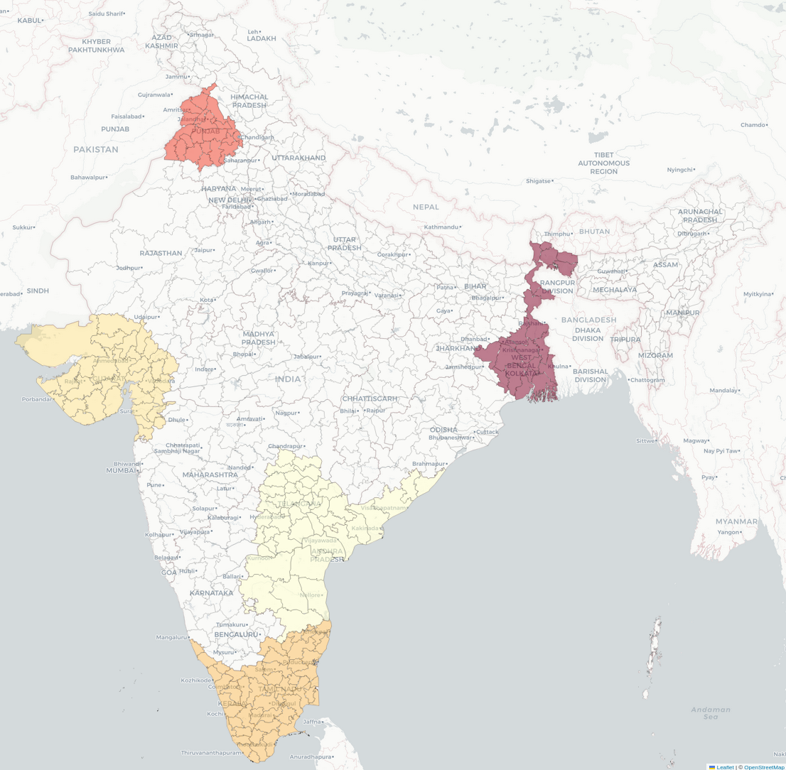

# Project Report

*A comprehensive market analysis to quantify obesity prevalence, patient profiles, and treatment patterns in India, providing data-driven insights to inform the commercial strategy for Wegovy.*

## Table of Contents

- [Project Report](#project-report)
	- [Table of Contents](#table-of-contents)
	- [Anti-Obesity Medication Market Sizing](#anti-obesity-medication-market-sizing)
		- [Obesity Prevalence](#obesity-prevalence)
		- [Semaglutide Market Size Forecasting](#semaglutide-market-size-forecasting)
	- [Diabetes Subphenotype-Based Market Identification](#diabetes-subphenotype-based-market-identification)
		- [Introduction](#introduction)
		- [Data Assets](#data-assets)
		- [Feature Normalisation Strategy](#feature-normalisation-strategy)
		- [Derived Proxy Indices](#derived-proxy-indices)
		- [Subphenotype Attribution Workflow](#subphenotype-attribution-workflow)
		- [Prior Calibration and Regularisation](#prior-calibration-and-regularisation)
		- [Prioritisation Metrics for GLP-1 Planning](#prioritisation-metrics-for-glp-1-planning)
	- [Genomics-based Risk Analysis and Patient Profiling](#genomics-based-risk-analysis-and-patient-profiling)
		- [Introduction to DNA and Genetic Variation](#introduction-to-dna-and-genetic-variation)
		- [Methodology](#methodology)
			- [Population Selection and Genotype Data Processing](#population-selection-and-genotype-data-processing)
			- [Polygenic Risk Score (PRS) Selection and Preprocessing](#polygenic-risk-score-prs-selection-and-preprocessing)
			- [Scoring Individuals Using PLINK](#scoring-individuals-using-plink)
			- [Composite Scoring of Individuals](#composite-scoring-of-individuals)
		- [Key Results](#key-results)
			- [Computing Wegovy Suitability Score](#computing-wegovy-suitability-score)
				- [Target Phenotype Weights vs. Contraindication Weights](#target-phenotype-weights-vs-contraindication-weights)
		- [Key Insights](#key-insights)
	- [Market analysis](#market-analysis)
		- [Data Sources](#data-sources)
		- [Price Distribution Analysis](#price-distribution-analysis)
		- [Market Concentration Analysis](#market-concentration-analysis)
			- [Originator Manufacturer Dominance](#originator-manufacturer-dominance)
			- [Generic Manufacturer Distribution](#generic-manufacturer-distribution)
		- [Competition Intensity by Therapeutic Area](#competition-intensity-by-therapeutic-area)
		- [Similarity-Based Competition Prediction Model](#similarity-based-competition-prediction-model)
			- [Similarity Scoring Algorithm](#similarity-scoring-algorithm)
				- [Similarity Score Calculation](#similarity-score-calculation)
				- [Prediction Formula](#prediction-formula)
			- [Top Similar Drugs Analysis](#top-similar-drugs-analysis)
		- [Wegovy Market Entry Predictions](#wegovy-market-entry-predictions)
			- [Price Undercut Prediction](#price-undercut-prediction)
			- [Competitor Count Prediction](#competitor-count-prediction)
			- [Market Share Erosion Prediction Model](#market-share-erosion-prediction-model)
				- [Model Development and Validation](#model-development-and-validation)
				- [Model Performance](#model-performance)
			- [Feature Importance Analysis](#feature-importance-analysis)
		- [Wegovy Market Share Erosion Prediction](#wegovy-market-share-erosion-prediction)
	- [Full Cost of Diseases - Probability and Payout](#full-cost-of-diseases---probability-and-payout)
		- [Key High-Risk Associations (Hotspots)](#key-high-risk-associations-hotspots)
		- [Overall Trends](#overall-trends)
			- [Age 18-39 Years](#age-18-39-years)
			- [Age 40-64 Years](#age-40-64-years)
			- [Age 65+ Years](#age-65-years)
		- [Financial Liability](#financial-liability)
		- [Key Observations](#key-observations)
	- [Cost-Benefit Analysis Simulation](#cost-benefit-analysis-simulation)
		- [Parameterisation and Cohort Construction](#parameterisation-and-cohort-construction)
		- [Condition Incidence and Progression Graph](#condition-incidence-and-progression-graph)
		- [Modelling the GLP-1 Intervention](#modelling-the-glp-1-intervention)
		- [Individual State Machine and Event Memory](#individual-state-machine-and-event-memory)
		- [Cost Model and Cash-Flow Tracking](#cost-model-and-cash-flow-tracking)
		- [Output Diagnostics and Scenario Analysis](#output-diagnostics-and-scenario-analysis)
	- [Visualisation Module: Data Flow](#visualisation-module-data-flow)
		- [Data Assets](#data-assets-1)
		- [GeoJSON Augmentation and Layer Styling](#geojson-augmentation-and-layer-styling)


## Anti-Obesity Medication Market Sizing

### Obesity Prevalence

We used the NFHS-5 survey data to estimate the obesity prevalence within urban and rural populations in India and also to see differences in obesity prevalence across the two sexes. We also used [obesity prevalence data](https://ourworldindata.org/grapher/share-of-adults-defined-as-obese?tab=line&country=~IND&mapSelect=~IND) to see the trend in obesity rates from 1990 till 2022.


We also discovered the following relation between obesity prevalence rates across different age groups and gender through this [Lancet paper](https://www.thelancet.com/journals/lansea/article/PIIS2772-3682(23)00068-9/fulltext#:~:text=Economic%20survey%20of%20India%202022%2D23%20The%20prevalence,be%20more%20obese%20than%20the%20younger%20ones.):


### Semaglutide Market Size Forecasting

We saw the relation between [semaglutide market size in Germany](https://www.grandviewresearch.com/horizon/outlook/semaglutide-market/germany) and the [obesity prevalence rates in Germany](https://ourworldindata.org/grapher/share-of-adults-defined-as-obese?tab=chart&country=DEU). We assumed that the Indian semaglutide market will follow the same relation between obesity prevalence rates and market size as Germany, this was to estimate the market size of semaglutide in India. 

The following is the result of our market sizing algorithm (`preliminary/forecasting.ipynb`):


## Diabetes Subphenotype-Based Market Identification

### Introduction

This module estimates heterogeneity within the Indian type 2 diabetes population and communicates actionable insights for treatment prioritisation. Two coupled modules implement this objective. The `subphenotype/` pipeline transforms National Family Health Survey (NFHS-5) indicators into calibrated prevalence estimates for the five canonical indian diabetes clusters described in endocrinology literature. The `visualization/` workflow augments those outputs with adoption proxies and renders an interactive folium map that guides health planners toward districts most likely to benefit from glucagon-like peptide-1 (GLP-1) therapies.

### Data Assets

The processing pipeline consumes curated public health indicators assembled in `subphenotype/data/clean.csv` (derived from offical NFHS-5 data) The clean NFHS-5 matrix combines anthropometric, metabolic, and demographic measures across more than 700 districts.

### Feature Normalisation Strategy

Following schema checks, the notebook computes standardised indicators. Each series is mean-imputed and translated into a population-level z-score. The helper explicitly handles degenerate distributions by returning zero vectors when the standard deviation is zero or undefined — a contingency that can surface in sparsely populated districts where certain screenings were not performed. This choice neutralises outlier districts without introducing `NaN` cascades, allowing downstream matrix operations to remain stable. Standardisation is performed at the national level, respecting the comparative framing used in the clustering literature. Indicators measured separately for men and women (`OVER`, `UNDER`, `WAIST`, `HTN`, `GLU`) are averaged with equal weights after standardisation to construct sex-balanced signals.

### Derived Proxy Indices

The project distils ten observable indicators into four interpretable latent indices: insulin resistance (IR), insulin deficiency (DEF), glycaemic burden (GLY), and age-related risk (AGE). Each index is defined as a weighted sum of the z-scored features, with coefficients chosen to reflect consensus findings from cluster analyses in European, US, and Indo-Asian cohorts. For example, the insulin resistance score emphasises waist circumference (0.45) and overweight prevalence (0.35), capturing central adiposity, while adding a smaller hypertension component (0.20) to encode vascular consequences of systemic resistance. The deficiency index is dominated by underweight prevalence (0.50) but subtracts overweight and waist components to isolate lean phenotypes. Glycaemic burden is mapped directly to the pooled high-glucose prevalence since hyperglycaemia is already a composite indicator. The age-related index mirrors the aged population share, acknowledging the MARD (Mild Age-Related Diabetes) cluster’s defining trait.

### Subphenotype Attribution Workflow

Subtype attribution proceeds in two stages: raw logit estimation followed by probabilistic calibration. The raw logits are linear blends of the four proxies, with coefficients informed by clinical archetypes. A simplified summary is presented below:

| Subphenotype | Logit Formula Rationale |
| --- | --- |
| SIDD (Severe Insulin-Deficient Diabetes) | `0.50 × GLY + 0.30 × DEF − 0.20 × AGE` prioritises pronounced hyperglycaemia and deficiency while down-weighting older age to capture early-onset lean diabetes. |
| SIRD (Severe Insulin-Resistant Diabetes) | `0.60 × IR + 0.40 × GLY` reflects heavy reliance on central adiposity and metabolic syndrome markers. |
| CIRDD (Combined Insulin-Resistant and Deficient Diabetes) | `0.40 × GLY + 0.30 × IR + 0.30 × DEF` captures dual defects by blending resistance and deficiency in nearly equal measure. |
| MOD (Mild Obesity-Related Diabetes) | `0.40 × OVER − 0.30 × IR − 0.30 × GLY` highlights obesity while penalising overt insulin resistance and severe glycaemic burden, aligning with milder metabolic derangement. |
| MARD (Mild Age-Related Diabetes) | `0.60 × AGE − 0.20 × GLY − 0.10 × IR − 0.10 × OVER` rewards older populations with modest metabolic disturbance. |

The notebook applies a row-wise softmax to translate them into percentage shares. The softmax implementation subtracts the row-wise maximum before exponentiation to ensure numerical stability on wide-ranging logits. The resulting matrix encodes the uncalibrated distribution of subtypes for each district.

### Prior Calibration and Regularisation

Recognising that survey-derived signals can be noisy — especially in districts with limited sample sizes — the pipeline blends the softmax outputs with literature-based national priors. A lightweight `Prior` dataclass stores baseline prevalence weights (SIDD 25%, SIRD 30%, CIRDD 8%, MOD 2%, MARD 35%). The calibration applies a convex combination parameterised by `λ = 0.1`, yielding $p_\text{final} = \lambda \times p_\text{softmax} + (1 − \lambda) \times p_\text{prior}$. This shrinkage tempers district-specific volatility without obliterating real geographic variation. The priors are normalised to sum to 100%, ensuring probabilistic coherence.

### Prioritisation Metrics for GLP-1 Planning

Beyond subtype shares, the module computes two prioritisation scores. The first (`Priority_Score`) emphasises general diabetes burden by z-scoring the glycemic index and obesity proxy, combining them with weights 0.5 and 0.3 respectively, and scaling by 100 for readability. The second (`GLP1_Focused_Priority_Score`) extends this blend with additional emphasis on the SIRD and MOD shares — clusters most responsive to GLP-1 receptor agonists — through 0.05 weights on each. Scores remain relative, meaning a positive shift indicates a district performs above the national mean on the contributing factors.

## Genomics-based Risk Analysis and Patient Profiling

The preceding Diabetes Subphenotype-Based Market Identification module provided actionable insights into heterogeneity within the Indian type 2 diabetes population using survey-derived population-level indicators. It enabled calculation of district-level GLP-1 priority scores, highlighting regions where patients were likely to benefit most from GLP-1 receptor agonist therapies such as Wegovy.

However, this approach relies on aggregated survey data and hence could not perform patient profiling or risk stratification, as we lacked the granular, individual-level clinical data which would be necessary for such a task. 

To bridge this gap in data granularity, this module employs genomics-based disease predisposition scoring as a robust proxy for individual clinical risk. By analyzing each individual's genetic makeup against validated disease risk panels, we can estimate their inherent, lifelong predisposition to developing these conditions. This approach enables the construction of detailed patient profiles and the stratification of the population based not on current diagnoses, but on their underlying biological risk. The objective is to quantify the genetic propensity for both the cardiometabolic conditions where Wegovy is most beneficial and, crucially, for the key contraindications that demand clinical caution. 

When repeated for a number of individuals across multiple ethnicities, this adds a powerful, forward-looking biological dimension to the market map, complementing the epidemiological insights with a deeper understanding of patient suitability at a molecular level. 

### Introduction to DNA and Genetic Variation

The foundation of this analysis rests on heritable genetic variation. The most common form of variation in the human genome consists of Single Nucleotide Polymorphisms (SNPs), which are changes at single positions in the DNA sequence. While rare diseases are often caused by a single high-impact variant (monogenic), the risk for common, complex conditions like obesity and Type 2 Diabetes is polygenic. This means their etiology is influenced by the cumulative effect of thousands of SNPs, each conferring a small, incremental change to an individual's risk.

A Polygenic Risk Score (PRS) is a quantitative metric developed to capture this complexity. It is calculated for each disease, via a penalized regression framework to aggregate the effects of these numerous variants across an individual's genome into a single, composite score. This score serves as a powerful estimate of an individual's latent genetic susceptibility to a given disease, providing a measure of predisposition independent of environmental or lifestyle factors.

### Methodology

The genomics-based risk analysis was implemented in multiple steps, transforming raw population genotype data into interpretable patient-level and state-level risk profiles. Each step is described in detail below.

#### Population Selection and Genotype Data Processing

We focused on the South Asian (SAS) superpopulation from the 1000 Genomes Project to represent the Indian population and used the European (EUR) superpopulation as a reference to estimate relative risk differences.

- SAS-specific and EUR-specific ethnicities were compiled from project metadata.
- Processed genotype files were downloaded from [Zenodo](https://zenodo.org/records/6614170) in PLINK binary format (.bed, .bim, .fam), aligned to the GRCh37 reference genome.
- This ensured compatibility with publicly available polygenic risk score (PRS) files.

Genotype files contain all the SNPs for each individual. The `.bim` file encodes variant positions and alleles, `.fam` contains individual IDs and demographic information, and `.bed` stores the genotype matrix efficiently in binary form.

#### Polygenic Risk Score (PRS) Selection and Preprocessing

Polygenic risk scores summarize the genetic contribution of multiple variants to a trait or disease. We curated PRS for:

- **Target phenotypes:** BMI, Type 2 Diabetes, Hypertension, Visceral Adiposity
- **Contraindications:** Thyroid Carcinoma, Pancreatitis, Gall Bladder Disease, Diabetic Eye Disease, Chronic Kidney Disease

For each PRS file:

- Only essential columns were retained: `chr:pos` (SNP location), `effect_allele`, and `effect_size` using `awk`.
- Files were harmonized to match the GRCh37 reference genome and PLINK input requirements.

#### Scoring Individuals Using PLINK

PLINK was used to calculate PRS for each disease, for each individual. Each SNP contributes to the score proportionally to its effect size, summing across all variants in the PRS file. This is the example command used to score each individual with the respective disease's PRS panel. 

```bash
plink --bfile SAS_1KG --score BMI_PRS.txt 1 2 3 header --out SAS_BMI_scores
```

#### Composite Scoring of Individuals

To facilitate interpretation:

- **Target Phenotype Score:** Weighted average of the four target PRS for each individual.
- **Contraindication Precaution Score:** Weighted average of the five contraindication PRS for each individual.

This allows simultaneous assessment of potential treatment benefit and safety risk.

### Key Results


***Figure 1:** Relative risk distribution for SAS vs EUR across target phenotypes*

We first compared the South Asian (SAS) superpopulation to the European (EUR) reference to assess relative predisposition to the four target phenotypes.

SAS individuals displayed significantly higher genetic susceptibility for Obesity and Type 2 Diabetes ($p = 6.28 \times 10^{-100}$ and p = $4.56 \times 10^{-44}$), supporting the increasing evidence of elevated metabolic risk in South Asian populations and highlighting the massive potential market for Anti-Obesity Medications in India. 

Visceral Adiposity and Hypertension PRS were more evenly distributed between SAS and EUR, although subtle shifts suggested a slightly elevated baseline in SAS.


***Figures 2 and 3:** Distribution of target and contraindication PRS across SAS subpopulations*

We stratified SAS individuals by subpopulation (PJL: Punjabi, GIH: Gujarati, BEB: Bengali, STU: Tamil, ITU: Telugu) to examine intra-population heterogeneity.

- **Target Phenotypes:** Genetic predisposition for the 4 target diseases varied across ethnicities. However, we note highest genetic risk for obesity among Punjabis and Tamils, which strongly aligns with epidemiological evidence from the nation-wide NFHS surveys.  

- **Contraindication Scores:** There were no notable differences in the ethnicity-specific risk distributions for any of the contraindications, supporting the notion that contraindication risk operates predominantly at the individual-level and is not specific to any of the ethnicities. 

#### Computing Wegovy Suitability Score

To translate individual-level genetic risk into a single actionable metric for treatment prioritisation, we defined a Wegovy Suitability Score (WSS) for each individual. This score integrates predisposition to target phenotypes with risk of contraindications, providing a quantitative proxy for net treatment benefit.

The WSS is calculated as:

$$\text{Wegovy Suitability Score (WSS)} = \underbrace{\sum_{i=1}^{4} w_i \cdot \text{Target}_i}_{\text{Composite Target Phenotype Score}} - \underbrace{\sum_{j=1}^{5} v_j \cdot \text{Contraindication}_j}_{\text{Composite Contraindication Score}}$$

where:

- $\text{Target}_{i,k}$ represents the polygenic risk score of individual $k$ for the $i$-th target phenotype, with $i\in$ {BMI, T2D, Hypertension, Visceral Adiposity}.

- $\text{Contraindication}_{j,k}$ represents the polygenic risk score of individual $k$ for the $j$-th contraindication, with $j\in$  {Thyroid Carcinoma, Pancreatitis, Gall Bladder Disease, Diabetic Eye Disease, Chronic Kidney Disease}.
  
- $w_i$ and $v_j$ are weights reflecting the relative clinical relevance of each trait.

##### Target Phenotype Weights vs. Contraindication Weights

| Target Phenotype        | Weight $w_i$ |
|-------------------------|----------------|
| BMI                     | 0.60           |
| Type 2 Diabetes (T2D)   | 0.25           |
| Hypertension            | 0.05           |
| Visceral Adiposity      | 0.10           |

| Contraindication        | Weight $v_j$ |
|-------------------------|----------------|
| Thyroid Carcinoma       | 0.25           |
| Pancreatitis            | 0.15           |
| Gall Bladder Disease    | 0.15           |
| Diabetic Eye Disease    | 0.10           |
| Chronic Kidney Disease  | 0.20           |

***Table 1:** Target Phenotype Weights vs. Contraindication Weights*

Interpretation:

- $\text{WSS}_k > 0$: Likely good candidate for Wegovy treatment.  
- $\text{WSS}_k \leq 0$: Potential risk outweighs benefit; caution recommended.

The WSS metric was subsequently used for individual-level scatter plots (Target Score vs Contraindication Score) and state-level choropleth maps, enabling identification of high-value markets for Wegovy rollout.


***Figure 4:** Scatter plot of individual Target Score vs Contraindication Precaution Score*

This figure plots Target Phenotype Score vs Contraindication Score for each individual to identify candidates with high potential benefit but elevated safety risk.

- Most individuals clustered near the diagonal, with balanced benefit-risk profiles.

- A subset (~5–10%) displayed high target scores with high contraindication risk, signaling that genetic screening could guide treatment decisions and reduce adverse outcomes.

This step demonstrates how PRS-based profiling can stratify patients at an individual level, complementing district-level survey data.



***Figure 5:** Choropleth map of India showing Wegovy Suitability Score*

By mapping SAS subpopulations to Indian states, we calculated mean target and contraindication scores per state and derived a Wegovy Suitability Score.

- The Northern ethnicity (Punjab, Haryana) generally showed higher suitability scores due to elevated target phenotype risk and moderate contraindication scores.

- The Eastern ethnicity (Bengal) showed highest suitability score, as individuals had, on average, moderately high scores for the 4 target diseases, and high risks for the contraindications.
  
- Southern ethnicities (Tamil Nadu, Kerala) also had high suitability scores, driven by higher mean target disease scores despite similar contraindication risk.


***Figure 6:** Choropleth map of India showing Wegovy Suitability Score*

- These scores were overlaid with wealth quintiles and health insurance coverage to identify regions with both high genetic benefit and commercial viability.
- This integrated view highlights priority markets where a combination of genetic predisposition, socioeconomic factors, and insurance coverage suggest high potential uptake and impact of Wegovy.

### Key Insights

1. Genetic heterogeneity matters: Subpopulation-level differences within SAS can significantly influence both benefit and risk profiles.
2. Targeted treatment is feasible: PRS-based scoring identifies individuals likely to gain maximal benefit while avoiding contraindications.
3. Strategic regional focus: Combining genetic, economic, and insurance data points to specific Indian states as high-priority markets, complementing survey-based GLP-1 priority scores.
4. Risk-aware commercialization: The framework supports precision marketing and patient-centric rollout, enabling interventions to be both safe and effective.

## Market analysis 

### Data Sources

- **Primary Dataset**: 221,387 pharmaceutical records from Indian market (generic_vs_branded_analysis.csv)
- **Similarity Dataset**: 1,052 drug compounds with therapeutic area and mechanism scores
- **Market Share Dataset**: 28 drugs with observed market share erosion data

### Price Distribution Analysis

Analysis of 221,387 pharmaceutical records revealed significant price disparities between originator and generic drugs. The distribution of price differences follows a right-skewed distribution with the following statistical parameters:

- **Mean price difference**: 74.5% (σ = 15.2%)
- **Median price difference**: 77.9%
- **Range**: 0% to 95.4%
- **95th percentile**: 89.2%


### Market Concentration Analysis

#### Originator Manufacturer Dominance

- Sun Pharmaceutical Industries Ltd: 15.3% of market
- Emcure Pharmaceuticals Ltd: 12.7% of market  
- Cipla Ltd: 11.2% of market
- Top 10 originators control 67.8% of market

#### Generic Manufacturer Distribution

- Mylan Pharmaceuticals Pvt Ltd: 18.4% of generics
- Cipla Ltd: 16.1% of generics
- Abbott: 14.7% of generics
- Top 10 generic manufacturers control 72.3% of generic market


### Competition Intensity by Therapeutic Area

Analysis of ingredient-level competition revealed:

- **Highest competition**: Metformin (1,223 generic competitors)
- **Diabetes drugs**: Dapagliflozin (337 competitors), Sitagliptin (144 competitors)

### Similarity-Based Competition Prediction Model

####  Similarity Scoring Algorithm

A weighted similarity scoring system was developed to predict Wegovy's market entry impact using the following mathematical framework:

##### Similarity Score Calculation

$S_{\text{disease}} = \frac{\text{Disease similarity} - \min}{\max - \min}$

$S_{\text{tass}} = \frac{\text{TASS score} - \min}{\max - \min}$

$S_{\text{price}} = 1 - \frac{\lvert \text{originator price} - \text{wegovy price} \rvert}{\text{wegovy price}}$

$S_\text{final} = 0.7 \times S_\text{disease} + 0.2 \times S_\text{tass} + 0.1 \times S_\text{price}$

##### Prediction Formula

$\text{Predicted\_Undercut} = \frac{\sum \left( \text{price difference pct} \times S_{\text{final}} \right)}{\sum S_{\text{final}}}$

#### Top Similar Drugs Analysis 

The top 5 most similar drugs to Wegovy, ranked by `S_final` score:

| Rank | Drug | S_final | Therapeutic Area | Price Difference % |
|------|------|---------|------------------|-------------------|
| 1 | Cetilistat | 0.909 | Obesity | 0.0% |
| 2 | Orlistat | 0.896 | Obesity management | 55.2% |
| 3 | Rimonabant | 0.886 | Obesity (withdrawn) | 50.8% |
| 4 | Insulin Aspart | 0.873 | Diabetes | 58.8% |
| 5 | Canagliflozin | 0.866 | Type 2 Diabetes | 0.3% |

### Wegovy Market Entry Predictions

#### Price Undercut Prediction

- **Mean predicted undercut**: 51.7%
- **Standard Error**: 1.25%


#### Competitor Count Prediction

- **Predicted competitors**: 112.2 (weighted average)
- **Range**: 2-1,223 competitors (based on similar drugs)
- **Distribution**: Right-skewed with median of 15.3 competitors


#### Market Share Erosion Prediction Model


#####  Model Development and Validation
A logarithmic regression model was developed using 8 predictor variables to predict market share erosion. Data set was built on research paper of chinese generic study and similarity scores were assigned to each compound with respect to wegovy:


##### Model Performance

- **R² (log space)**: 0.303 (p < 0.001)
- **R² (original space)**: -0.067 (indicating log transformation necessity)
- **Mean Squared Error**: 423.32
- **F-statistic**: 12.47 (p < 0.001)

####  Feature Importance Analysis

Standardized Coefficients (log space):

| Feature | Coefficient | Standard Error | t-value | p-value |
|---------|-------------|----------------|---------|---------|
| Market Status Score | 0.5975 | 0.089 | 6.71 | <0.001 |
| Price Ratio (Q1) | 0.5029 | 0.076 | 6.62 | <0.001 |
| Administration Score | 0.3304 | 0.091 | 3.63 | <0.01 |
| Population Scale Score | 0.1629 | 0.078 | 2.09 | <0.05 |
| MoA Novelty Score | -0.2997 | 0.085 | -3.53 | <0.01 |
| Price/Reimbursement Score | -0.2441 | 0.092 | -2.65 | <0.05 |
| Generic Contributors | -0.0137 | 0.089 | -0.15 | 0.88 |
| Therapeutic Area Score | -0.0492 | 0.094 | -0.52 | 0.61 |

###  Wegovy Market Share Erosion Prediction

**Input Parameters:**
- Number of Competitors: 112.2
- Price Ratio: 2.0 (50% undercut assumption)
- All feature scores: 10/10 asuming wegovy itself is a perfect match

**Predicted Market Share Drop**: **7.3%**
- Share drop increases with increase in price ratio linearly
- Share drop decreases with increase in number of competitors linearly


## Full Cost of Diseases - Probability and Payout


This heatmap displays the conditional probability of developing a "Target Disease" given a "Disease Already Present" across three age groups: 18-39, 40-64, and 65+ years. Color intensity indicates probability, with yellow being highest and dark blue lowest.

### Key High-Risk Associations (Hotspots)

- Hypertension leading to CKD/DKD: A persistent and intensifying risk across all age groups.
- Obesity influencing CHD, HF, and Hypertension: A broad risk factor, particularly in older individuals.
- Dyslipidemia leading to CHD: A strong and consistent association.
- Prediabetes progressing to T2D: Most pronounced in middle and older age groups.
- T2D increasing risk for CHD, CKD/DKD, and Hypertension: A significant concern in the 65+ demographic.

### Overall Trends

Probabilities generally increase with age, reflecting accumulated health risks. While some associations are consistent across all ages, others emerge or intensify in older cohorts.

#### Age 18-39 Years

- Obesity shows moderate links to CHD and HF.
- Hypertension is a strong predictor of CKD/DKD.
- Dyslipidemia correlates moderately with CHD.
- PCOS is linked to higher probabilities of Hypertension and T2D.
- Many pre-existing conditions have low predictive power for specific outcomes in this younger group.

#### Age 40-64 Years

- Probabilities generally become more pronounced.
- Obesity maintains a broad influence, predicting CHD, CKD/DKD, HF, and Hypertension.
- The Hypertension -> CKD/DKD link remains strong, possibly intensifying.
- Dyslipidemia and CHD continue their robust association.
- HF as an existing condition shows a higher probability of leading to CKD/DKD.
- Prediabetes notably increases the risk of T2D.

#### Age 65+ Years

- This group exhibits the highest overall probabilities, indicating elevated cumulative risks.
- Obesity is a major predictor for a wide range of outcomes, including CHD, CKD/DKD, HF, Hypertension, and potentially Osteoporosis.
- The Hypertension $\to$ CKD/DKD relationship is consistently very high.
- CHD as a pre-existing condition strongly predicts HF.
- T2D significantly increases the probabilities for CHD, CKD/DKD, Dyslipidemia, and Hypertension.
- Osteoporosis and Osteoarthritis (OA) show strong reciprocal probabilities, highlighting musculoskeletal interactions in older adults.

### Financial Liability


This bar chart illustrates the estimated financial burden for various diseases and complications, broken down into one-time and annual recurring costs, expressed in thousands of Indian Rupees (INR).

### Key Observations

- Significant Cost Variances: There's a wide range in both one-time and annual recurring costs across different diseases.
- Dominance of One-Time Costs: For most conditions, the one-time costs are significantly higher than the annual recurring costs.
- High-Cost Diseases: Liver Cirrhosis, CKD (Chronic Kidney Disease), and Heart Failure stand out as having exceptionally high one-time costs. Malignancies also present substantial one-time costs.

The data highlights that certain critical illnesses (Liver Cirrhosis, CKD, Heart Failure, Malignancies) pose immense financial burdens, primarily through high initial treatment costs, but also through significant recurring expenses for conditions like CKD and Malignancies. Understanding these cost disparities is crucial for healthcare planning, insurance policies, and patient financial counseling in India. This data is crucial for calculating insurer payouts based on various insurance policies, such as the HDFC ERGO Optima Secure Plan, Star Health Super Star Plan, and HDFC ERGO Day2Day Care Plan, helping to determine coverage for both initial treatments and ongoing management.

## Cost-Benefit Analysis Simulation

The `cba/` directory hosts a Monte Carlo cost-benefit prototype that estimates the lifetime financial impact of scaling GLP-1 therapy (modelled as Wegovy) within an insured population. Rather than relying on static actuarial ratios, the notebook `simulation.ipynb` tracks simulated individuals year-by-year, contrasting status quo care with a counterfactual in which every covered member initiates Wegovy at the start of plan eligibility. The design goal is to translate the epidemiologic insights from the subphenotype module into insurer-facing insights: what aggregate expenditures might look like when cardiometabolic complications are mitigated by sustained weight loss.

### Parameterisation and Cohort Construction

Scenario levers live at the top of the notebook as scalars: the default population size (`POPULATION_SIZE = 1000`), simulation horizon (`SIMULATION_YEARS = 60`), coverage rate (`PERCENTAGE_COVERED = 1.0`), upfront therapy price (`WEGOVY_COST = 209000` rupees), and a derived annual cost (`WEGOVY_ANNUAL_COST`) that scales with plan coverage. Individuals are drawn by the helper `create_population`, which samples 40% of the cohort between ages 18–39 and 60% between 40–64. Each simulated member receives a random height between 1.5 m and 1.9 m and a weight drawn from a skewed beta distribution, generating BMI values centred in the low 30s to represent an at-risk pool. Insurance start ages are sampled within each age band to let enrolment precede or coincide with chronic disease onset.


### Condition Incidence and Progression Graph

Disease onset is driven by two nested dictionaries — `obese_first_order_probs` and `non_obese_first_order_probs` — that map age groups to annual probabilities for thirteen cardiometabolic, hepatic, musculoskeletal, and mental-health diagnoses. The notebook selects the appropriate ladder by checking whether the individual’s BMI exceeds 30, capturing the higher baseline risk carried by obese members. Once a condition is acquired, `second_order_probs` governs cascading complications via conditional probabilities that depend on both the current disease load and age bracket. For example, an obese 45-year-old with hypertension automatically faces a 17% chance of coronary heart disease and a 36% chance of diabetes in the subsequent cycle, while chronic kidney disease elevates heart-failure risk above 20%. These graph-based transitions give the model enough fidelity to represent multimorbidity without introducing opaque machine-learning components.

### Modelling the GLP-1 Intervention

When coverage includes Wegovy, each individual samples a personalised efficacy draw from a beta distribution when they reach their insurance start age. The sampled value calibrates a sustained one-time weight reduction (`weight_loss = weight × efficacy`) and toggles the `on_wegovy` flag. The notebook keeps a compact `efficacy_factors` dictionary to apply relative risk reductions to severe outcomes such as coronary heart disease (−20%), heart failure (−20%), type 2 diabetes (−71%), and chronic kidney disease (−18%). Remission probabilities are handled by `recovery_params`, which attaches a Hill-curve response to every managed condition. The helper `probability_of_recovery` merges cumulative weight loss (`deltaW`) and current BMI through two logistic-style factors, yielding higher remission odds for conditions known to respond strongly to weight reduction (e.g., prediabetes, obstructive sleep apnoea) and very low odds for difficult-to-reverse states such as malignancies.

### Individual State Machine and Event Memory

The `Individual` class encapsulates the member lifecycle, tracking age, anthropometrics, active conditions, interventions already billed, and a `recovered_from` ledger. During each yearly `update()` call the model: (1) attempts recoveries for active conditions if Wegovy is on board; (2) samples secondary complications based on the existing condition set and age category; (3) samples first-order occurrences using either the obese or non-obese probability table; and finally (4) increments age.

### Cost Model and Cash-Flow Tracking

Economic outputs are computed through `cost_to_insurer()`, which accumulates one-time procedure costs and recurring management spend. The `one_time_costs` table covers acute episodes such as oncology interventions (₹700,000), bypass surgery for coronary disease (₹600,000), and end-stage renal care (₹1,695,629). Annual burden is captured in `annual_costs` for chronic maintenance—ranging from ₹30329 for diabetes management to ₹858,000 for renal replacement therapy. Whenever Wegovy is active, the annual drug spend is added to the tally.

### Output Diagnostics and Scenario Analysis

After simulating the full horizon, the code interpolates cumulative cost trajectories onto a uniform `years_grid`, stacks them into matrices, and computes cohort means. Visual diagnostics generated with seaborn and matplotlib include kernel density estimates for initial BMI and insurance start age, as well as “spaghetti plots” that overlay individual and average cumulative costs in the treatment and control arms.


## Visualisation Module: Data Flow

The `visualization/heatmap.ipynb` notebook transforms numerical outputs from the subphenotype and genetic modules into an interactive policy tool. To reconcile inconsistent naming across sources, a string normalisation helper strips whitespace, converts text to lowercase, and applies targeted alias replacements (`aizawl → aizawal`, `belgaum → belagavi`, `aravali → aravalli`). District-level GLP-1 priority scores are mapped through `(district_key, state_key)` tuples, while state-level genetic risk is keyed solely by state name, reflecting the granularity of the source table.

The notebook repurposes the same `z_norm` helper from the subphenotype module to construct an adoption proxy that blends wealth quintile prevalence (70%) with health insurance coverage (30%). The adoption score and raw insurance share are separately exposed in the map to differentiate readiness from financial protection.

### Data Assets

This module utilizes geospatial assets in `subphenotype/data/assets/districts.geojson`.

### GeoJSON Augmentation and Layer Styling

After preparing lookups, the visualisation pipeline iterates through every GeoJSON feature, augmenting its `properties` with four new keys: `glp1_score`, `genetic_risk`, `adoption_score`, and `insurance_score`. Values that cannot be matched remain `None`, which downstream folium components treat as gaps instead of zero.